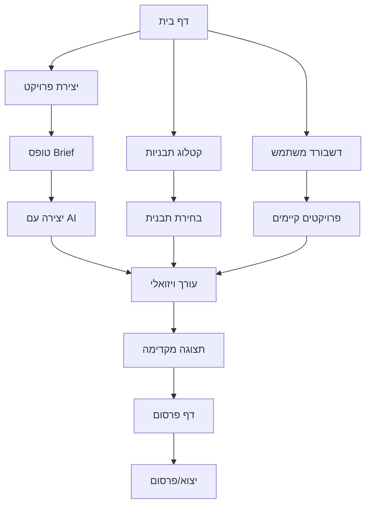

# מסמך דרישות מוצר - Landing Page Builder עם AI

## 1. Product Overview

מערכת מתקדמת ליצירת דפי נחיתה באמצעות בינה מלאכותית. המערכת מאפשרת למשתמשים ליצור דפי נחיתה מקצועיים ללא ידע טכני מוקדם, תוך שימוש בעורך drag & drop מתקדם ובינה מלאכותית ליצירת תוכן מותאם אישית.
- המערכת פותרת את הבעיה של יצירת דפי נחיתה יקרים ומורכבים, ומיועדת לעסקים קטנים ובינוניים, יזמים ומשווקים דיגיטליים.
- המטרה היא להפוך את תהליך יצירת דפי הנחיתה לפשוט, מהיר וזמין לכולם, תוך הבטחת תוצאות מקצועיות ואיכותיות.

### סטטוס פיתוח נוכחי (ינואר 2025)
**✅ הושלם:**
- מערכת התחברות מלאה (Login/Register/Admin)
- דף הבית משופר עם אנימציות
- עורך GrapesJS מתקדם עם תמיכה בעברית ו-RTL
- תבנית Modern Business משופרת עם סקשנים: About Us, Services, Testimonials, Contact
- 2 תבניות נוספות: Creative Agency ו-E-commerce Store
- רכיב TemplateCard משופר עם תצוגה מקדימה ואנימציות
- תיקון שגיאות client components
- אינטגרציית AI עם OpenRouter ליצירת תוכן מותאם
- מבנה טכני מלא (Next.js 14, TypeScript, TailwindCSS)

**🔄 בתהליך:**
- מערכת תבניות HTML/CSS מתקדמת
- קומפוננטים נוספים למערכת התבניות

**❌ נותר לביצוע:**
- מערכת חיפוש וסינון תבניות מתקדמת
- מערכת מועדפים והיסטוריית שימוש
- שילוב Supabase לשמירת פרויקטים בענן
- אופטימיזציה, ביצועים ונגישות
- רקע אינטראקטיבי לעמוד הבית (דרישה חדשה)

## 2. תכונות עיקריות

### 2.1 תפקידי משתמשים

| תפקיד | שיטת הרשמה | הרשאות עיקריות |
|-------|-------------|------------------|
| משתמש רגיל | הרשמה באימייל | יצירה ועריכה של דפי נחיתה, שימוש בתבניות חינמיות |
| משתמש פרימיום | שדרוג בתשלום | גישה לתבניות מתקדמות, יצוא ללא הגבלה, פרסום ישיר |
| מנהל מערכת | הזמנה ישירה | ניהול תבניות, ניתוח נתונים, ניהול משתמשים |

### 2.2 מודולי תכונות

המערכת מורכבת מהדפים הראשיים הבאים:
1. **דף הבית**: hero section עם רקע אינטראקטיבי, ניווט ראשי, תצוגת תבניות מובילות
2. **דף התחברות/הרשמה**: טפסי authentication, אימות משתמשים
3. **דף יצירת פרויקט**: אשף יצירה בן 4 שלבים עם AI
4. **עורך דפי נחיתה**: עורך GrapesJS מתקדם עם drag & drop
5. **דף תבניות**: גלריית תבניות עם חיפוש וסינון
6. **דף ניהול פרויקטים**: רשימת פרויקטים, עריכה ומחיקה
7. **דף מועדפים**: תבניות שמורות למועדפים
8. **דף היסטוריה**: היסטוריית שימוש בתבניות

### 2.3 רקע אינטראקטיבי לעמוד הבית (תכונה חדשה)
**מטרה**: הפיכת עמוד הבית למרשים ואינטראקטיבי בסגנון AI מתקדם

**תכונות עיקריות**:
- **10 רקעים אנימציים שונים**: כל רקע עם אנימציה ייחודית ומרשימה
- **החלפה אוטומטית**: כל דקה בערך החלפת רקע אוטומטית
- **בחירה רנדומלית חכמה**: אלגוריתם שמונע חזרה על אותו רקע פעמיים רצוף
- **אינטראקטיביות**: קליק על הרקע מפעיל אפקט מיוחד או אנימציה
- **קומפוננטה נפרדת**: ניתן להפעיל/לכבות ללא השפעה על שאר האתר
- **ביצועים מותאמים**: אנימציות מותאמות לביצועים ללא השפעה על מהירות האתר

**רעיונות לרקעים**:
1. חלקיקים צבעוניים נעים בתנועה אורגנית
2. גלים דיגיטליים זורמים
3. רשת משתנה של קווים וחיבורים
4. אורות צפוניים דיגיטליים
5. פיקסלים מתפוצצים ומתאחדים
6. גרדיאנטים נעים ומשתנים
7. צורות גיאומטריות מסתובבות
8. אפקט מטריקס עם קוד זורם
9. כוכבים נוצצים ברקע חלל
10. אנרגיה חשמלית זורמת

**אינטראקטיביות בקליק**:
- פיצוץ צבעוני במקום הקליק
- גלי אנרגיה מהמרכז החוצה
- שינוי זמני של הרקע
- אפקט "ריפל" על פני המסך
- הופעת אלמנטים מיוחדים זמניים

### 2.4 פירוט דפים

| שם דף | שם מודול | תיאור תכונה | סטטוס |
|-----------|-------------|---------------------|----------|
| דף הבית | Hero Section | הצגת כותרת ראשית, תיאור המוצר, כפתור CTA ראשי | ✅ הושלם |
| דף הבית | רקע אינטראקטיבי | 10 רקעים אנימציים, החלפה כל דקה, אינטראקטיביות בקליק | ❌ חדש |
| דף הבית | תצוגת תבניות | הצגת 3-4 תבניות מובילות עם תמונות ותיאורים קצרים | ✅ הושלם |
| דף התחברות | טופס התחברות | שדות email/password, validation, הודעות שגיאה | ✅ הושלם |
| דף הרשמה | טופס הרשמה | שדות פרטים אישיים, אימות סיסמה, תנאי שימוש | ✅ הושלם |
| דף יצירה | אשף 4 שלבים | פרטי עסק, מטרות ותוכן, עיצוב וסגנון, סיכום | ✅ הושלם |
| דף יצירה | אינטגרציית AI | יצירת תוכן מותאם עם OpenRouter API, fallback content | ✅ הושלם |
| עורך | GrapesJS | עורך drag & drop מלא, בלוקים מוכנים, ניהול סגנונות | ✅ הושלם |
| עורך | תבניות מוכנות | Modern Business (משופרת), Creative Agency, E-commerce | ✅ הושלם |
| עורך | תמיכה בעברית | RTL support, פונטים עבריים, Tailwind CSS | ✅ הושלם |
| דף תבניות | גלריית תבניות | הצגת כל התבניות בפריסת grid, TemplateCard משופר | 🔄 חלקי |
| דף תבניות | חיפוש וסינון | חיפוש בזמן אמת, סינון לפי קטגוריה ותעשייה | ❌ נותר |
| דף תבניות | מערכת מועדפים | שמירת תבניות למועדפים, דף מועדפים נפרד | ❌ נותר |
| דף תבניות | היסטוריית שימוש | מעקב אחר תבניות שנוצרו, timeline design | ❌ נותר |
| דשבורד | ניהול פרויקטים | רשימת פרויקטים, עריכה, מחיקה, שיתוף | ❌ נותר |
| כללי | שמירה בענן | אינטגרציה עם Supabase, גיבוי אוטומטי | ❌ נותר |

## 3. תהליך עיקרי

### זרימת עבודה למשתמש רגיל:
1. המשתמש נכנס לדף הבית ולוחץ "התחל עכשיו"
2. ממלא טופס Brief עם פרטי העסק והדרישות
3. המערכת שולחת את הנתונים ל-AI ומייצרת דף נחיתה אוטומטי
4. הדף נטען לעורך הויזואלי לעריכה ושיפורים
5. המשתמש יכול להוסיף רכיבים, לשנות צבעים ולערוך תוכן
6. לאחר סיום העריכה, בוחר באפשרות פרסום או יצוא
7. המערכת מפרסמת את הדף או מספקת קובץ ZIP להורדה

### זרימת עבודה למשתמש פרימיום:
1. גישה לקטלוג התבניות המלא עם אפשרויות סינון מתקדמות
2. יכולת לשמור מספר פרויקטים במקביל
3. גישה לרכיבים מתקדמים ואנימציות
4. פרסום ישיר ללא הגבלות עם תמיכה בדומיינים מותאמים

## 4. עיצוב ממשק משתמש

### 4.1 סגנון עיצוב

- **צבעים עיקריים**: #1a73e8 (כחול ראשי), #f8fafc (רקע בהיר), #1e293b (טקסט כהה)
- **צבעים משניים**: #10b981 (ירוק הצלחה), #ef4444 (אדום שגיאה), #f59e0b (כתום אזהרה)
- **סגנון כפתורים**: פינות מעוגלות (8px), צללים עדינים, אפקטי hover
- **פונטים**: Inter (ראשי), JetBrains Mono (קוד), גדלים 14-48px
- **סגנון פריסה**: Grid מודרני, כרטיסים עם צללים, ניווט עליון קבוע
- **אייקונים**: Lucide React, סגנון מינימליסטי, גודל 16-24px

### 4.2 סקירת עיצוב דפים

| שם הדף | שם המודול | אלמנטי UI |
|---------|-----------|------------|
| דף בית | סקשן Hero | רקע גרדיאנט כחול-סגול, כותרת גדולה (48px), כפתור CTA בולט עם אנימציה |
| דף בית | גלריית תבניות | Grid של 3x2 כרטיסים, hover effects, כפתורי "תצוגה מקדימה" |
| יצירת פרויקט | טופס Brief | פורם מרובה שלבים עם progress bar, validation בזמן אמת |
| עורך ויזואלי | ממשק GrapesJS | פאנל צד שמאלי לרכיבים, toolbar עליון, canvas מרכזי עם rulers |
| עורך ויזואלי | פאנל מאפיינים | פאנל צד ימני עם tabs לעיצוב/תוכן/הגדרות |
| קטלוג תבניות | רשימת תבניות | Masonry layout עם כרטיסים, lazy loading, infinite scroll |
| דף פרסום | אפשרויות יצוא | כרטיסי בחירה עם אייקונים, progress indicators |

### 4.3 רספונסיביות

המערכת מתוכננת כ-desktop-first עם התאמה מלאה למובייל וטאבלט. כל הרכיבים מותאמים למגע עם targets מינימליים של 44px. תמיכה מלאה ב-RTL עבור עברית וערבית עם flip אוטומטי של פריסות ואייקונים.

