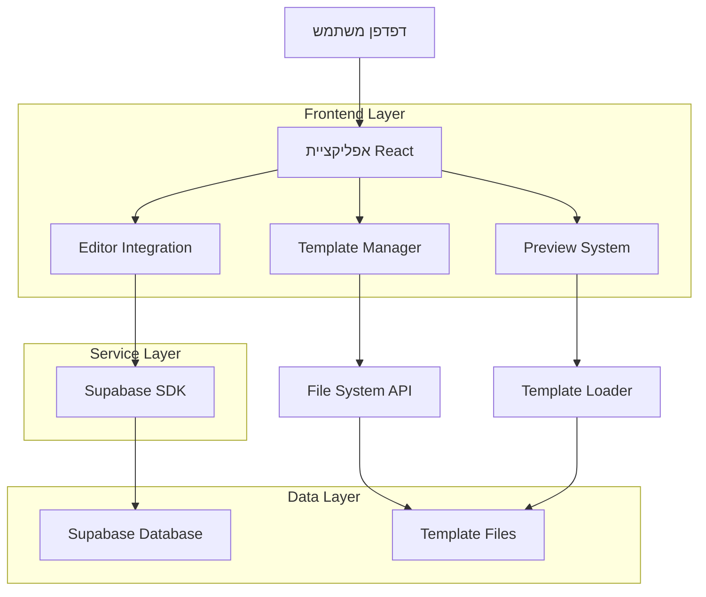
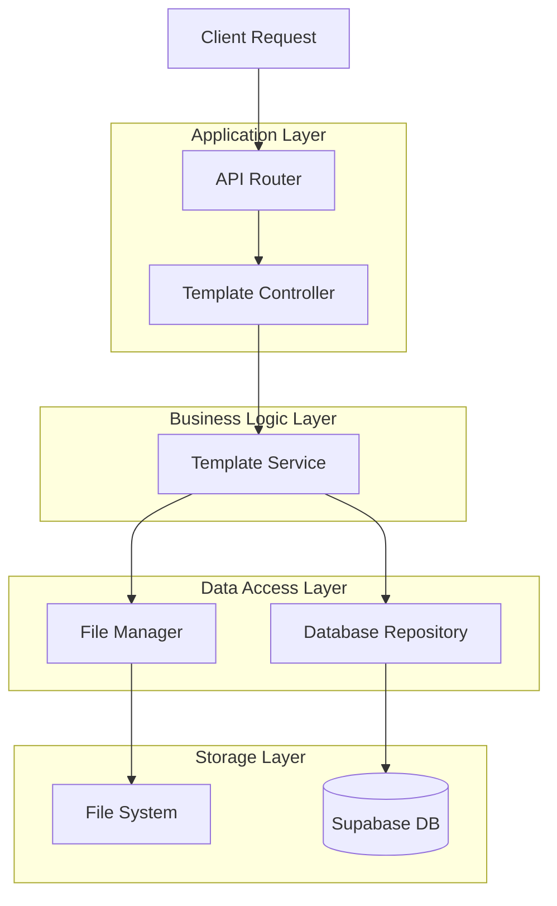
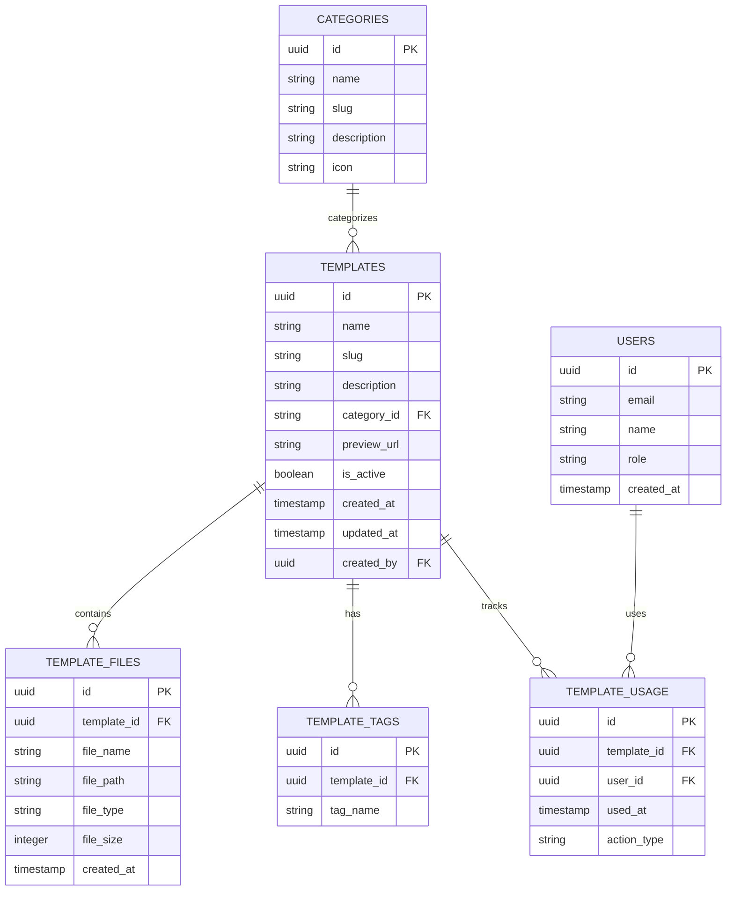

# מסמך ארכיטקטורה טכנית - מערכת תבניות

## 1. עיצוב ארכיטקטורה



## 2. תיאור טכנולוגיות

- **Frontend**: React@18 + TypeScript + TailwindCSS@3 + Vite
- **Backend**: Supabase (Authentication, Database, Storage)
- **Template Storage**: File System + Supabase Storage
- **State Management**: Zustand
- **Routing**: React Router@6

## 3. הגדרות נתיבים

| נתיב | מטרה |
|------|-------|
| / | דף בית עם גלריית תבניות |
| /templates | רשימת כל התבניות עם סינון |
| /template/:id | דף תבנית ספציפית עם preview |
| /editor/:templateId | עורך התבנית |
| /admin/templates | ניהול תבניות (העלאה, עריכה) |
| /admin/analytics | דוחות שימוש ואנליטיקה |

## 4. הגדרות API

### 4.1 Core API

**ניהול תבניות**
```
GET /api/templates
```

Request:
| שם פרמטר | סוג פרמטר | נדרש | תיאור |
|-----------|------------|------|-------|
| category | string | false | סינון לפי קטגוריה |
| search | string | false | חיפוש טקסט חופשי |
| limit | number | false | מספר תוצאות מקסימלי |
| offset | number | false | offset לעימוד |

Response:
| שם פרמטר | סוג פרמטר | תיאור |
|-----------|------------|-------|
| templates | Template[] | מערך תבניות |
| total | number | סה"כ תבניות |
| hasMore | boolean | האם יש עוד תוצאות |

דוגמה:
```json
{
  "templates": [
    {
      "id": "barbershop-modern",
      "name": "Modern Barbershop",
      "category": "business",
      "description": "תבנית מספרה מודרנית",
      "previewUrl": "/templates/barbershop/preview.jpg",
      "tags": ["business", "barbershop", "modern"]
    }
  ],
  "total": 15,
  "hasMore": false
}
```

**טעינת תבנית ספציפית**
```
GET /api/templates/:id
```

Response:
| שם פרמטר | סוג פרמטר | תיאור |
|-----------|------------|-------|
| template | TemplateDetail | פרטי התבנית המלאים |
| files | TemplateFile[] | קבצי התבנית |

**העלאת תבנית חדשה**
```
POST /api/templates
```

Request:
| שם פרמטר | סוג פרמטר | נדרש | תיאור |
|-----------|------------|------|-------|
| name | string | true | שם התבנית |
| category | string | true | קטגוריה |
| description | string | true | תיאור |
| files | File[] | true | קבצי התבנית |
| tags | string[] | false | תגיות |

## 5. ארכיטקטורה שרת



## 6. מודל נתונים

### 6.1 הגדרת מודל נתונים



### 6.2 הגדרת שפת נתונים (DDL)

**טבלת קטגוריות**
```sql
-- יצירת טבלה
CREATE TABLE categories (
    id UUID PRIMARY KEY DEFAULT gen_random_uuid(),
    name VARCHAR(100) NOT NULL,
    slug VARCHAR(100) UNIQUE NOT NULL,
    description TEXT,
    icon VARCHAR(50),
    created_at TIMESTAMP WITH TIME ZONE DEFAULT NOW()
);

-- הוספת אינדקס
CREATE INDEX idx_categories_slug ON categories(slug);

-- נתונים ראשוניים
INSERT INTO categories (name, slug, description, icon) VALUES
('עסקים מקומיים', 'business', 'תבניות לעסקים מקומיים כמו מספרות, בתי קפה ומסעדות', 'building-storefront'),
('טכנולוגיה', 'technology', 'תבניות לחברות טכנולוגיה וסטארט-אפים', 'computer-desktop'),
('נדל"ן', 'real-estate', 'תבניות למשרדי תיווך ונדל"ן', 'home-modern'),
('שירותים מקצועיים', 'professional', 'תבניות לעורכי דין, רואי חשבון ויועצים', 'briefcase'),
('בריאות', 'health', 'תבניות לקליניקות, רופאים ושירותי בריאות', 'heart');
```

**טבלת תבניות**
```sql
-- יצירת טבלה
CREATE TABLE templates (
    id UUID PRIMARY KEY DEFAULT gen_random_uuid(),
    name VARCHAR(200) NOT NULL,
    slug VARCHAR(200) UNIQUE NOT NULL,
    description TEXT,
    category_id UUID REFERENCES categories(id),
    preview_url VARCHAR(500),
    is_active BOOLEAN DEFAULT true,
    created_at TIMESTAMP WITH TIME ZONE DEFAULT NOW(),
    updated_at TIMESTAMP WITH TIME ZONE DEFAULT NOW(),
    created_by UUID REFERENCES auth.users(id)
);

-- יצירת אינדקסים
CREATE INDEX idx_templates_category ON templates(category_id);
CREATE INDEX idx_templates_active ON templates(is_active);
CREATE INDEX idx_templates_created_at ON templates(created_at DESC);
CREATE INDEX idx_templates_slug ON templates(slug);

-- נתונים ראשוניים
INSERT INTO templates (name, slug, description, category_id, preview_url) 
SELECT 
    'Modern Barbershop',
    'modern-barbershop',
    'תבנית מספרה מודרנית עם עיצוב גברי ומקצועי',
    c.id,
    '/templates/barbershop/preview.jpg'
FROM categories c WHERE c.slug = 'business';
```

**טבלת קבצי תבניות**
```sql
-- יצירת טבלה
CREATE TABLE template_files (
    id UUID PRIMARY KEY DEFAULT gen_random_uuid(),
    template_id UUID REFERENCES templates(id) ON DELETE CASCADE,
    file_name VARCHAR(255) NOT NULL,
    file_path VARCHAR(500) NOT NULL,
    file_type VARCHAR(50) NOT NULL,
    file_size INTEGER,
    created_at TIMESTAMP WITH TIME ZONE DEFAULT NOW()
);

-- יצירת אינדקס
CREATE INDEX idx_template_files_template_id ON template_files(template_id);
CREATE INDEX idx_template_files_type ON template_files(file_type);
```

**טבלת תגיות**
```sql
-- יצירת טבלה
CREATE TABLE template_tags (
    id UUID PRIMARY KEY DEFAULT gen_random_uuid(),
    template_id UUID REFERENCES templates(id) ON DELETE CASCADE,
    tag_name VARCHAR(50) NOT NULL
);

-- יצירת אינדקס
CREATE INDEX idx_template_tags_template_id ON template_tags(template_id);
CREATE INDEX idx_template_tags_name ON template_tags(tag_name);
```

**הרשאות Supabase**
```sql
-- הרשאות לטבלת קטגוריות
GRANT SELECT ON categories TO anon;
GRANT ALL PRIVILEGES ON categories TO authenticated;

-- הרשאות לטבלת תבניות
GRANT SELECT ON templates TO anon;
GRANT ALL PRIVILEGES ON templates TO authenticated;

-- הרשאות לטבלת קבצים
GRANT SELECT ON template_files TO anon;
GRANT ALL PRIVILEGES ON template_files TO authenticated;

-- הרשאות לטבלת תגיות
GRANT SELECT ON template_tags TO anon;
GRANT ALL PRIVILEGES ON