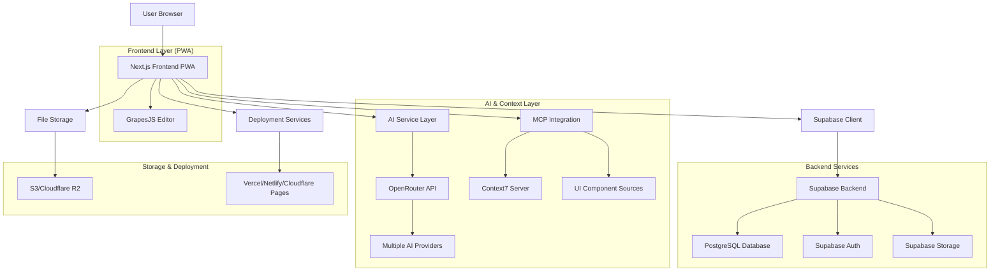
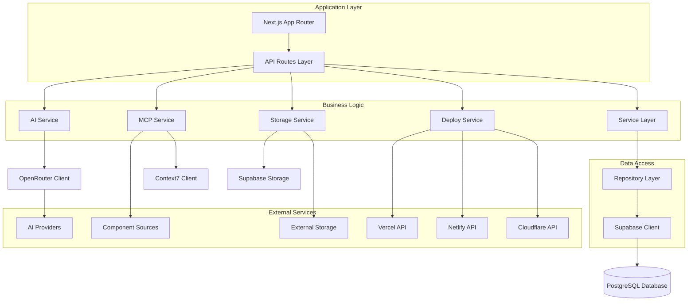
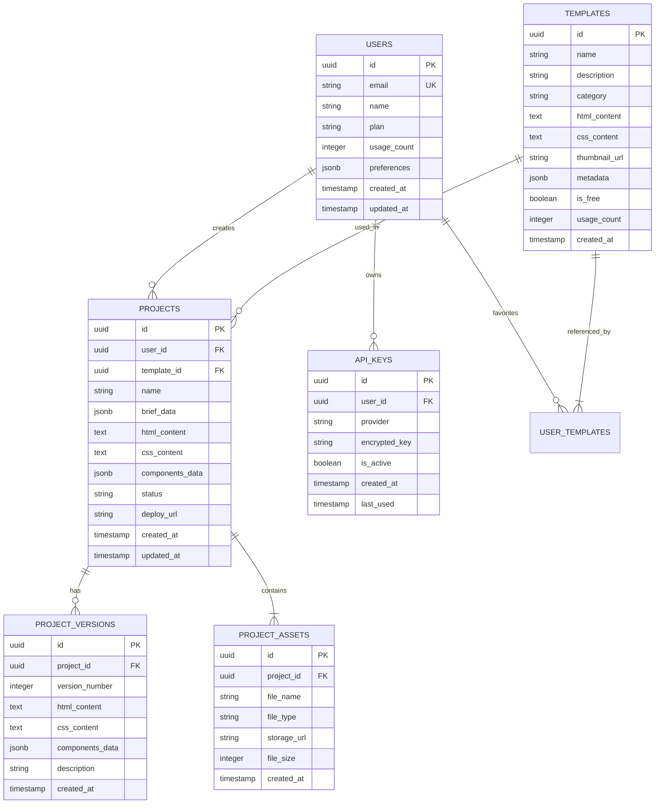

# מסמך ארכיטקטורה טכנית - Landing Page Builder עם AI

## 1. עיצוב ארכיטקטורה



## 2. תיאור טכנולוגיות

- **Frontend**: Next.js 14 (App Router) + React 18 + TypeScript + TailwindCSS + shadcn/ui
- **עורך ויזואלי**: GrapesJS Studio SDK + React integration
- **AI Layer**: OpenRouter (multi-model) + BYOK support (OpenAI, Anthropic, Gemini, Mistral)
- **MCP Integration**: Context7 + MUI MCP + Custom component servers
- **Backend**: Supabase (Auth + Database + Storage) + Next.js API Routes
- **Database**: PostgreSQL (via Supabase)
- **File Storage**: Cloudflare R2 / AWS S3
- **Deployment**: Vercel + Netlify + Cloudflare Pages integration
- **PWA**: Service Worker + Web App Manifest + Offline support

## 3. הגדרות נתיבים

| נתיב | מטרה |
|------|-------|
| / | דף בית עם hero section וגלריית תבניות |
| /create | יצירת פרויקט חדש עם טופס Brief |
| /editor/[id] | עורך ויזואלי GrapesJS לפרויקט ספציפי |
| /templates | קטלוג תבניות מלא עם סינון וחיפוש |
| /template/[id] | תצוגה מקדימה של תבנית ספציפית |
| /dashboard | דשבורד משתמש עם רשימת פרויקטים |
| /project/[id] | הגדרות פרויקט ואפשרויות פרסום |
| /publish/[id] | דף פרסום עם יצוא ופרסום ישיר |
| /auth/login | דף התחברות עם Supabase Auth |
| /auth/register | דף הרשמה עם אימות אימייל |
| /settings | הגדרות חשבון ו-API keys |

## 4. הגדרות API

### 4.1 Core API

**יצירת פרויקט חדש**
```
POST /api/projects
```

Request:
| שם פרמטר | סוג פרמטר | נדרש | תיאור |
|-----------|------------|------|-------|
| name | string | true | שם הפרויקט |
| brief | object | true | נתוני Brief (תחום, קהל יעד, צבעים וכו') |
| template_id | string | false | ID של תבנית בסיס |

Response:
| שם פרמטר | סוג פרמטר | תיאור |
|-----------|------------|-------|
| id | string | מזהה הפרויקט החדש |
| html | string | HTML שנוצר על ידי AI |
| css | string | CSS שנוצר על ידי AI |
| status | string | סטטוס היצירה |

Example:
```json
{
  "name": "אתר חברת הייטק",
  "brief": {
    "industry": "technology",
    "target_audience": "B2B",
    "primary_color": "#1a73e8",
    "tone": "professional",
    "cta": "בקש הדגמה"
  }
}
```

**יצירת תוכן עם AI**
```
POST /api/ai/generate
```

Request:
| שם פרמטר | סוג פרמטר | נדרש | תיאור |
|-----------|------------|------|-------|
| prompt | string | true | הפרומפט ליצירת התוכן |
| model | string | false | מודל AI ספציפי |
| context | object | false | קונטקסט נוסף מ-MCP |

**שמירת פרויקט**
```
PUT /api/projects/[id]
```

Request:
| שם פרמטר | סוג פרמטר | נדרש | תיאור |
|-----------|------------|------|-------|
| html | string | true | HTML מעודכן מהעורך |
| css | string | true | CSS מעודכן מהעורך |
| components | object | false | מטא-דאטה של רכיבים |

**פרסום פרויקט**
```
POST /api/projects/[id]/deploy
```

Request:
| שם פרמטר | סוג פרמטר | נדרש | תיאור |
|-----------|------------|------|-------|
| provider | string | true | ספק הפרסום (vercel/netlify/cloudflare) |
| domain | string | false | דומיין מותאם אישית |
| settings | object | false | הגדרות פרסום נוספות |

### 4.2 MCP API Integration

**קבלת רכיבי UI**
```
GET /api/mcp/components
```

Response:
| שם פרמטר | סוג פרמטר | תיאור |
|-----------|------------|-------|
| components | array | רשימת רכיבים זמינים |
| categories | array | קטגוריות רכיבים |
| sources | array | מקורות המידע (Context7, MUI וכו') |

**חיפוש בתיעוד**
```
GET /api/mcp/search
```

Request:
| שם פרמטר | סוג פרמטר | נדרש | תיאור |
|-----------|------------|------|-------|
| query | string | true | מונח חיפוש |
| source | string | false | מקור ספציפי לחיפוש |

## 5. ארכיטקטורה שרת



## 6. מודל נתונים

### 6.1 הגדרת מודל נתונים



### 6.2 הגדרות DDL

**טבלת משתמשים (users)**
```sql
-- יצירת טבלה
CREATE TABLE users (
    id UUID PRIMARY KEY DEFAULT gen_random_uuid(),
    email VARCHAR(255) UNIQUE NOT NULL,
    name VARCHAR(100) NOT NULL,
    plan VARCHAR(20) DEFAULT 'free' CHECK (plan IN ('free', 'premium', 'enterprise')),
    usage_count INTEGER DEFAULT 0,
    preferences JSONB DEFAULT '{}',
    created_at TIMESTAMP WITH TIME ZONE DEFAULT NOW(),
    updated_at TIMESTAMP WITH TIME ZONE DEFAULT NOW()
);

-- יצירת אינדקסים
CREATE INDEX idx_users_email ON users(email);
CREATE INDEX idx_users_plan ON users(plan);
CREATE INDEX idx_users_created_at ON users(created_at DESC);

-- הרשאות Supabase
GRANT SELECT ON users TO anon;
GRANT ALL PRIVILEGES ON users TO authenticated;
```

**טבלת פרויקטים (projects)**
```sql
-- יצירת טבלה
CREATE TABLE projects (
    id UUID PRIMARY KEY DEFAULT gen_random_uuid(),
    user_id UUID NOT NULL REFERENCES users(id) ON DELETE CASCADE,
    template_id UUID REFERENCES templates(id),
    name VARCHAR(200) NOT NULL,
    brief_data JSONB DEFAULT '{}',
    html_content TEXT,
    css_content TEXT,
    components_data JSONB DEFAULT '{}',
    status VARCHAR(20) DEFAULT 'draft' CHECK (status IN ('draft', 'published', 'archived')),
    deploy_url VARCHAR(500),
    created_at TIMESTAMP WITH TIME ZONE DEFAULT NOW(),
    updated_at TIMESTAMP WITH TIME ZONE DEFAULT NOW()
);

-- יצירת אינדקסים
CREATE INDEX idx_projects_user_id ON projects(user_id);
CREATE INDEX idx_projects_template_id ON projects(template_id);
CREATE INDEX idx_projects_status ON projects(status);
CREATE INDEX idx_projects_created_at ON projects(created_at DESC);

-- הרשאות Supabase
GRANT SELECT ON projects TO anon;
GRANT ALL PRIVILEGES ON projects TO authenticated;
```

**טבלת תבניות (templates)**
```sql
-- יצירת טבלה
CREATE TABLE templates (
    id UUID PRIMARY KEY DEFAULT gen_random_uuid(),
    name VARCHAR(200) NOT NULL,
    description TEXT,
    category VARCHAR(50) NOT NULL,
    html_content TEXT NOT NULL,
    css_content TEXT NOT NULL,
    thumbnail_url VARCHAR(500),
    metadata JSONB DEFAULT '{}',
    is_free BOOLEAN DEFAULT true,
    usage_count INTEGER DEFAULT 0,
    created_at TIMESTAMP WITH TIME ZONE DEFAULT NOW()
);

-- יצירת אינדקסים
CREATE INDEX idx_templates_category ON templates(category);
CREATE INDEX idx_templates_is_free ON templates(is_free);
CREATE INDEX idx_templates_usage_count ON templates(usage_count DESC);
CREATE INDEX idx_templates_created_at ON templates(created_at DESC);

-- הרשאות Supabase
GRANT SELECT ON templates TO anon;
GRANT ALL PRIVILEGES ON templates TO authenticated;

-- נתונים ראשוניים
INSERT INTO templates (name, description, category, html_content, css_content, thumbnail_url, is_free) VALUES
('SaaS Startup', 'תבנית מודרנית לחברות SaaS עם hero section ופיצ׳רים', 'business', '<html>...</html>', 'body { font-family: Inter; }', '/thumbnails/saas-startup.jpg', true),
('E-commerce Store', 'תבנית לחנות אונליין עם גלריית מוצרים', 'ecommerce', '<html>...</html>', 'body { font-family: Inter; }', '/thumbnails/ecommerce.jpg', true),
('Portfolio Creative', 'תבנית לפורטפוליו אמנותי ויצירתי', 'portfolio', '<html>...</html>', 'body { font-family: Inter; }', '/thumbnails/portfolio.jpg', true);
```

**טבלת מפתחות API (api_keys)**
```sql
-- יצירת טבלה
CREATE TABLE api_keys (
    id UUID PRIMARY KEY DEFAULT gen_random_uuid(),
    user_id UUID NOT NULL REFERENCES users(id) ON DELETE CASCADE,
    provider VARCHAR(50) NOT NULL CHECK (provider IN ('openai', 'anthropic', 'gemini', 'mistral')),
    encrypted_key TEXT NOT NULL,
    is_active BOOLEAN DEFAULT true,
    created_at TIMESTAMP WITH TIME ZONE DEFAULT NOW(),
    last_used TIMESTAMP WITH TIME ZONE
);

-- יצירת אינדקסים
CREATE INDEX idx_api_keys_user_id ON api_keys(user_id);
CREATE INDEX idx_api_keys_provider ON api_keys(provider);
CREATE INDEX idx_api_keys_is_active ON api_keys(is_active);

-- הרשאות Supabase (רק למשתמש מחובר)
GRANT ALL PRIVILEGES ON api_keys TO authenticated;
```

**טבלת גרסאות פרויקט (project_versions)**
```sql
-- יצירת טבלה
CREATE TABLE project_versions (
    id UUID PRIMARY KEY DEFAULT gen_random_uuid(),
    project_id UUID NOT NULL REFERENCES projects(id) ON DELETE CASCADE,
    version_number INTEGER NOT NULL,
    html_content TEXT NOT NULL,
    css_content TEXT NOT NULL,
    components_data JSONB DEFAULT '{}',
    description VARCHAR(500),
    created_at TIMESTAMP WITH TIME ZONE DEFAULT NOW()
);

-- יצירת אינדקסים
CREATE INDEX idx_project_versions_project_id ON project_versions(project_id);
CREATE INDEX idx_project_versions_version_number ON project_versions(project_id, version_number DESC);
CREATE INDEX idx_project_versions_created_at ON project_versions(created_at DESC);

-- הרשאות Supabase
GRANT SELECT ON project_versions TO anon;
GRANT ALL PRIVILEGES ON project_versions TO authenticated;
```