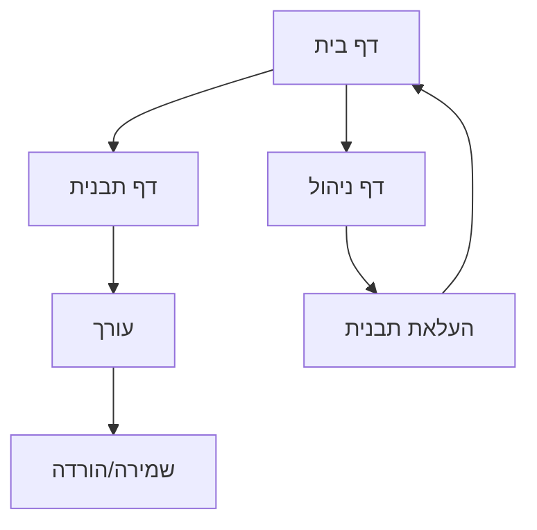

# מסמך דרישות מוצר (PRD) - מערכת תבניות חדשה

## 1. סקירת המוצר

מערכת תבניות מתקדמת לבניית דפי נחיתה ואתרים מהממים, המחליפה את הקובץ הענק הקיים (29,141 שורות) במבנה מודולרי ומסודר. המערכת תספק תבניות HTML/CSS/JS איכותיות עם עיצוב מקצועי ברמה גבוהה.

* פתרון לבעיית הקובץ הענק והכפילויות הקיימות

* מיועד למפתחים, מעצבים ובעלי עסקים הזקוקים לאתרים מקצועיים

* יעד: הפיכת יצירת אתרים למהירה, פשוטה ויפה

## 2. תכונות ליבה

### 2.1 תפקידי משתמש

| תפקיד         | שיטת רישום   | הרשאות ליבה                     |
| ------------- | ------------ | ------------------------------- |
| משתמש רגיל    | רישום חינמי  | גלישה ושימוש בתבניות בסיסיות    |
| משתמש פרימיום | מנוי חודשי   | גישה לכל התבניות, עריכה מתקדמת  |
| מפתח          | הזמנה מיוחדת | יצירת תבניות חדשות, ניהול מערכת |

### 2.2 מודול תכונות

המערכת כוללת את הדפים הבסיסיים הבאים:

1. **דף בית**: גלריית תבניות, חיפוש וסינון, קטגוריות
2. **דף תבנית**: תצוגה מקדימה, עריכה בזמן אמת, הורדה
3. **דף עורך**: עריכה ויזואלית, קוד HTML/CSS, שמירה
4. **דף ניהול**: העלאת תבניות, ניתוח שימוש, הגדרות

### 2.3 פרטי דפים

| שם הדף   | שם המודול      | תיאור התכונה                                        |
| -------- | -------------- | --------------------------------------------------- |
| דף בית   | גלריית תבניות  | הצגת כל התבניות בפריסה רספונסיבית עם תמונות preview |
| דף בית   | מערכת חיפוש    | חיפוש לפי שם, קטגוריה, תגיות עם אוטו-השלמה          |
| דף בית   | סינון קטגוריות | 15 קטגוריות עיקריות עם מונה תבניות                  |
| דף תבנית | תצוגה מקדימה   | iframe עם התבנית המלאה, מצבי desktop/mobile         |
| דף תבנית | מידע תבנית     | תיאור, תגיות, רמת קושי, זמן פיתוח                   |
| דף עורך  | עריכה ויזואלית | drag & drop, עריכת טקסט, החלפת תמונות               |
| דף עורך  | עורך קוד       | syntax highlighting, auto-complete, live preview    |
| דף ניהול | העלאת תבניות   | טופס העלאה, ולידציה, אישור                          |

## 3. תהליך ליבה

**זרימת משתמש רגיל:**

1. כניסה לדף הבית ← גלישה בגלריית התבניות
2. בחירת קטגוריה או חיפוש ← סינון התבניות
3. לחיצה על תבנית ← מעבר לדף התבנית
4. צפייה בתצוגה מקדימה ← החלטה על שימוש
5. לחיצה על "עריכה" ← מעבר לעורך
6. עריכת התבנית ← שמירה והורדה

**זרימת מפתח:**

1. כניסה לדף ניהול ← העלאת תבנית חדשה
2. מילוי פרטי התבנית ← העלאת קבצים
3. בדיקת תצוגה מקדימה ← אישור ופרסום

## 4. עיצוב ממשק משתמש

### 4.1 סגנון עיצוב

* **צבעים עיקריים**: #2563eb (כחול), #f8fafc (רקע), #1e293b (טקסט)

* **צבעים משניים**: #10b981 (הצלחה), #ef4444 (שגיאה), #f59e0b (אזהרה)

* **סגנון כפתורים**: מעוגלים עם צללים עדינים, אפקטי hover

* **גופנים**: Inter (ראשי), JetBrains Mono (קוד), גודל בסיס 16px

* **פריסה**: מבוססת כרטיסים, ניווט עליון קבוע

* **אייקונים**: Heroicons, סגנון מינימליסטי

### 4.2 סקירת עיצוב דפים

| שם הדף   | שם המודול     | אלמנטי UI                                              |
| -------- | ------------- | ------------------------------------------------------ |
| דף בית   | גלריית תבניות | Grid רספונסיבי, כרטיסים עם hover effects, lazy loading |
| דף בית   | חיפוש         | שדה חיפוש עם אייקון זכוכית מגדלת, dropdown suggestions |
| דף תבנית | תצוגה מקדימה  | iframe מלא, כפתורי toggle desktop/mobile               |
| עורך     | פאנל כלים     | sidebar עם אייקונים, tooltips, drag handles            |

### 4.3 רספונסיביות

המערכת מותאמת לכל המכשירים:

* Desktop-first approach עם breakpoints: 1280px, 1024px, 768px, 640px

* תמיכה מלאה במגע למכשירים ניידים

* אופטימיזציה לטאבלטים עם ממשק היברידי

* תמיכה ב-RTL/LTR לשפות שונות

